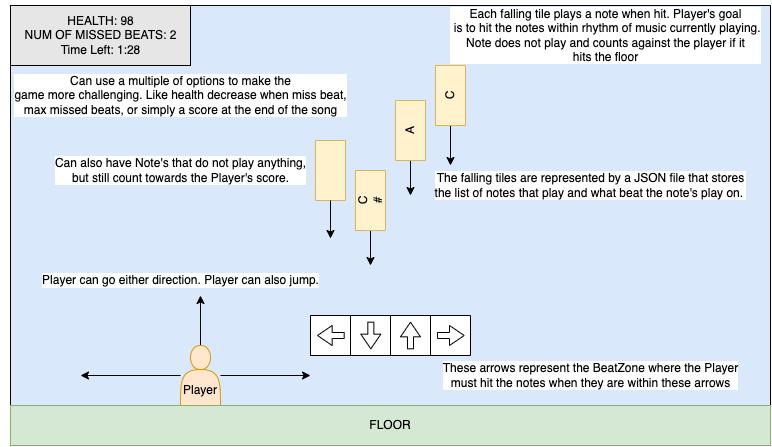

# rhythm-game
A rhythm game created for the CSCI-437 final project.

## Installation / Local Setup
1) Clone the repository ``git clone https://github.com/MujyKun/rhythm-game.git``
2) Go to the repo directory ``cd rhythm-game``
3) Running with Python ^3.9 is recommended. 
4) Install requirements with either 
   1) ``pip install -r requirements.txt`` 
      1) If you do not have pip, you can install it with ``python get-pip.py`` or ``python -m ensurepip --upgrade``
   2) If you have poetry you can use ``poetry install``.  
5) Start the program with `python main.py`  


## General/Optional Features
   - Frames Per Second (By default capped to 30 FPS)
     - FPS Counter follows camera and is pinned to the top left.
   - Expandable Canvas
     - Can go outside base resolution.
     - Dynamic Resolution 
       - All sprites are customizable to the window resolution (Including the Camera, Background, and Player)
   - Camera Implementation
     - Can Zoom In/Out with the `-` or `+` keys.
     - Scrollable Camera (Will follow a player that leaves the camera boundaries)
   - Player Types
     - Can create a folder in [player](assets/player) to generate a type.
     - Can animate by unpacking a sprite-sheet and placing the animation type in a new directory.  
   - Player Movement
     - Set Vertical Movement (Keys defaulted to `W` & `S`)
     - Set Horizontal Movement (Keys defaulted to `A` & `D`)
     - Set Jump Movement (Key defaulted to `Spacebar`)
       - Optional Implementation to allow several jumps at a time. 
       - Currently set to only allow jumping while on a floor.
     - Camera Restrictions - Can choose whether the player can move outside the camera range.
     - Gravity (This has only been implemented for the player)
       - Implementations for both Moon and Earth gravity.
   - Background
     - Can be animated or an individual image.
     - Animated backgrounds should go [here](assets/background)
   - Music Tiles
     - Images can be found [here](assets/tiles)
     - Audio can be found [here](assets)
   - Songs
     - Songs can be generated and loaded using JSON.
     - A song should be saved [here](assets)
     - A song should follow the following format: 
     - ```json
       {
       "song": {
          "name": "Test Song",
          "tiles": { 
              "10": ["C#3" , "C#3"],
              "20": ["C#3", "C#3"],
              "30": ["C#3", "C#3"],
              "40": ["C#3", "C#3"],
              "50": ["C#3", "d#3"],
              "60": ["C#3", "d#3"],
              "70": ["C#3", "d#3"],
              "80": ["C#3", "d#3"],
              "90": ["C#3", "d#3"],
              "100": ["C3", "G#3"],
              "110": ["C3", "G#3"],
              "120": ["C3", "G#3"],
              "130": ["C3", "G#3"],
              "140": ["C3", "F3"]
          }
        }
       }
       ```
        - The name is the song name.
        - The tile key consists of the beat number.
        - The tile value consists of the notes played at that specific beat.
        - The limit to the number of notes played on a single beat is dependent on:
          - The number of audio channels present.
          - The number of columns available in the game.
   - Holding Keys
     - Keys not released are stored in a list for continuous execution. 
     - Implemented more specifically for camera zooming.
   - Cursor Movement
     - Cursor Position follows the camera and is pinned to the top left (Below the FPS Counter).
   - Layering
     - Layering has been implemented into sprites so that sprites on top are consistent.


## Game Design Document



## Example GIFs

### Different Player Types


### "Earth" Gravity


### "Moon" Gravity


### Player Locked to Camera


### Camera Following Player


### Camera Not Following Player


### Several Jumps


    
